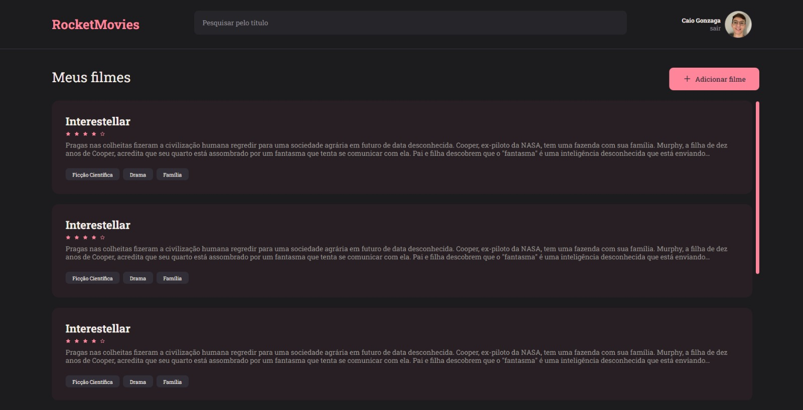

<h1 align="center">Rocket Movies</h1>

A basic frontend development.
ATENÇÃO: OS SERVIDORES SÃO GRATUITOS PORTANTO AO CLICAR,
AGUARDE 1 MINUTO, ATUALIZE A PAGINA PARA QUE O PROJETO SEJA INICIALIZADO

  <a href="#-technologies">Technologies</a>&nbsp;&nbsp;&nbsp;|&nbsp;&nbsp;&nbsp;
  <a href="#-libraries">Libraries</a>&nbsp;&nbsp;&nbsp;|&nbsp;&nbsp;&nbsp;
  <a href="#-project">Project</a>&nbsp;&nbsp;&nbsp;|&nbsp;&nbsp;&nbsp;
  <a href="#memo-license">License</a>

  

 

    

## 🛠️ Technologies

This project was developed with the following technologies:

- HTML and CSS
- JavaScript
- ReactJs
- Vite
- NodeJs
- Figma
- Git and Github

## 📖 Libraries

This project was developed with the following libraries:

- styled components
- react icons
- react router dom

## 💻 Project

- This is the Front-end for the Rocket Movies App.

## :memo: License

This project is under the MIT license.

---

Check my others projects!👋